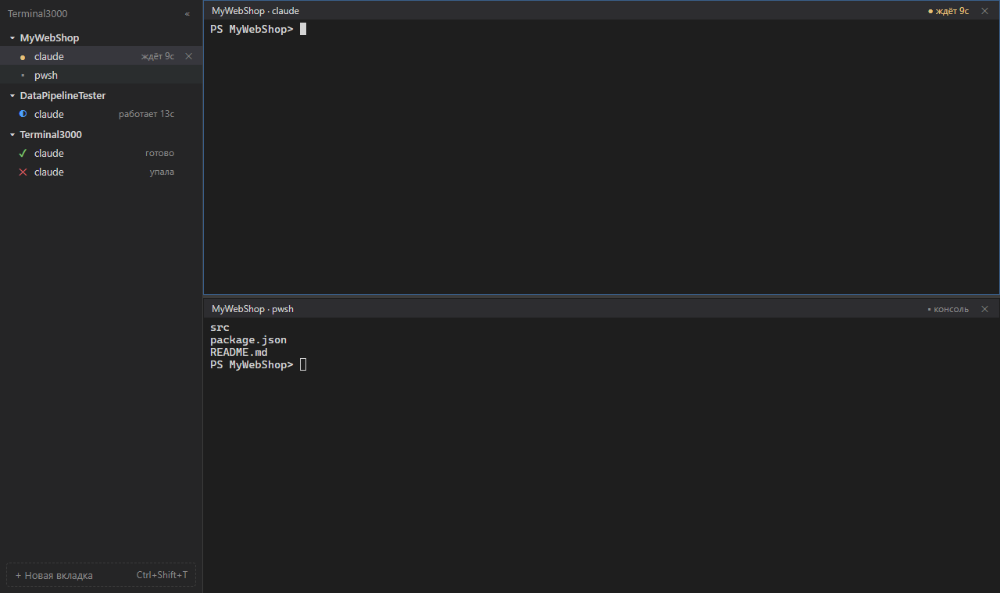
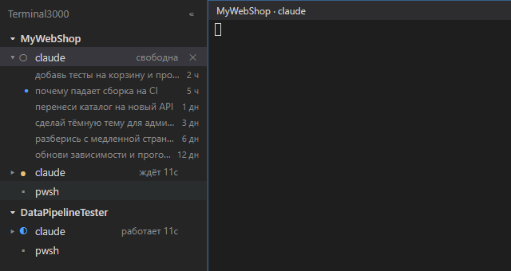

# Terminal3000

**English** · [Русский](README.ru.md)

A Windows terminal for keeping several [Claude Code](https://docs.claude.com/claude-code) sessions and regular consoles in one place.

Running several Claude Code sessions side by side in plain PowerShell windows gets messy fast. The windows all look the same, so you cycle through them to find the right one. Claude sits waiting for permission in a minimized window, and you notice half an hour later. A console for `git` or tests is yet another window that can't sit next to the session. After a reboot you rebuild everything by hand: `cd` into each folder, run `claude --resume`, find the right conversation. Terminal3000 keeps every session in one window, tells you which one needs you, and brings tabs and conversations back after a restart.



- **Sidebar** with all tabs grouped by project. You can see which Claude is working, which is waiting for an answer or permission, and which has finished. Right-click a group to start a new Claude session or console in its folder.
- **Notifications and sound** when Claude is waiting for you or has finished in a tab you aren't looking at. Clicking a notification opens the tab.
- **Splits**: several sessions and a project console on one screen. A Claude tab comes on screen with its project's console below it, and a console brings its project's Claude above it, so a Claude never ends up over another folder's console. ``Ctrl+` `` hides the console.
- **Past conversations** right in the sidebar: the ▸ arrow next to a Claude tab lists the project's earlier conversations, and a click brings one back. See [Past conversations](#past-conversations).
- **Palette** (`Ctrl+Shift+P`): tabs, projects, past Claude conversations and commands.
- **Restore**: after a restart you get the same tabs and splits, and Claude continues the same conversations via `claude --resume`.
- Your PowerShell profile with your keys is loaded in every tab. Terminal3000 never reads it.

The app's interface is in Russian. Below, UI labels are quoted in Russian with an English translation in parentheses.

## Requirements

- Windows 10 or 11 (x64; on arm64, build from source);
- [Node.js](https://nodejs.org) 20.19 or newer (LTS);
- [Git](https://git-scm.com);
- [Claude Code](https://docs.claude.com/claude-code), with the `claude` command available in PowerShell.

Visual Studio Build Tools aren't needed: `node-pty` ships with prebuilt binaries.

## Installing from source

```powershell
git clone https://github.com/St1nkos1/Terminal3000.git
cd Terminal3000
npm install
npm start
```

`npm start` builds the app and launches it. For development with hot reload, use `npm run dev`.

## Building the installer

```powershell
npm run dist
```

The installer appears at `release\Terminal3000 Setup 0.1.0.exe`. It installs the app for the current user; administrator rights aren't needed.

## First launch and hooks

Claude statuses come from [Claude Code hooks](https://docs.claude.com/claude-code/hooks). On first launch Terminal3000 asks for permission and adds entries like this to `%USERPROFILE%\.claude\settings.json` for the `SessionStart`, `UserPromptSubmit`, `PostToolUse`, `Notification`, `Stop` and `SessionEnd` events:

```json
{ "type": "command", "command": "node", "args": ["C:/…/Terminal3000/hooks/t3000-hook.js"], "async": true, "timeout": 5 }
```

- Before any change, a copy `settings.json.bak-<date>` is saved next to the file. Other hooks and settings are left untouched.
- The hook is asynchronous and never delays Claude. Outside Terminal3000 it exits immediately.
- If `node` isn't found (an installed build on a machine without Node), `Terminal3000.exe --t3000-hook` is registered instead.
- If the app has moved to another folder, a banner «путь к хуку устарел» (hook path is outdated) appears with an «Обновить хуки» (Update hooks) button.
- To remove the hooks: palette (`Ctrl+Shift+P`) → «Удалить хуки Claude Code» (Remove Claude Code hooks). Only entries containing `t3000-hook` are removed.

Claude sessions started before the hooks were installed begin sending statuses after a restart.

## Past conversations



Click ▸ next to a Claude tab to see the project's past conversations, newest first: the same ones `claude --resume` offers in that folder. It's handy when you need to recall something from an old conversation or pick up a specific one.

- A click opens the conversation in a new Claude tab via `--resume`, started with your [`claudeCommand`](#your-own-claude-command). The current tab keeps working.
- ● marks a conversation that's already open in another tab. A click switches to that tab instead of starting a second copy.
- The tab's own conversation isn't listed. The sidebar shows the 10 most recent; «Все разговоры (N)…» (All conversations) opens the full list in the palette, with search.
- The list is re-read every time you expand it, so new conversations show up without a restart.

## Keys

| Key | Action |
|---|---|
| `Ctrl+Shift+P` | Palette: tabs, projects, past conversations, commands |
| `Ctrl+Shift+T` | New tab: a console in the home folder (first item, Enter), or a folder or project, then Claude (new / continue / pick a conversation) or a console |
| `Ctrl+1…9` | Nth tab in sidebar order |
| `Ctrl+Tab` / `Ctrl+Shift+Tab` | Next / previous by recency |
| `Ctrl+Shift+J` | Next tab that is waiting (then one that is done) |
| ``Ctrl+` `` | Project console under the current tab |
| `Ctrl+Shift+\` / `Ctrl+Shift+-` | Split vertically / horizontally |
| `Ctrl+Shift+F` | Search in output |
| `F2` | Rename tab (or double-click it in the sidebar) |
| `Ctrl+Shift+W` | Close tab (or the × on the tab row and in the pane header, or the middle mouse button) |
| `Ctrl+Shift+M` | Do Not Disturb until restart |

Closing asks for confirmation only if Claude in the tab is working or waiting for an answer. Shortcuts work in any keyboard layout. In the terminal: `Ctrl+C` copies when there's a selection and interrupts otherwise; `Ctrl+V` and right-click paste; `Shift+Enter` inserts a line break in Claude's input; a file dropped onto the window is pasted as its path.

## Settings

Settings live in `%APPDATA%\Terminal3000\config.json`. The file is created on first launch; you can open it with the palette command «Открыть настройки» (Open settings). Changes are picked up without a restart. If the file has an error, the app shows it in a banner and keeps the previous settings.

| Key | Default | What it does |
|---|---|---|
| `defaultShell` | `"powershell"` | Shell for a new console: a key from `shells` |
| `shells` | `powershell`, `cmd`, `gitbash` | Your own shells: `{ "file": "…", "args": [] }` |
| `claudeCommand` | `"claude"` | Command that starts Claude |
| `projectRoots` | `[]` | Folders whose subfolders are shown as projects |
| `restore` | `"lazy"` | `"lazy"`: inactive tabs start when opened; `"eager"`: all at once |
| `font` | `Cascadia Mono, Consolas, monospace`, 14 | Terminal font |
| `scrollback` | `10000` | Lines of scrollback history |
| `webgl` | `true` | `false` renders without WebGL, if you see artifacts |
| `consoleUnderClaude` | `true` | A Claude tab comes on screen with its project's console below it (created if missing), and a console with its project's Claude above it; `false` turns this off |
| `status.silenceMs` | `4000` | Milliseconds of silence before "working" turns into "idle" |
| `notifications` | all `true`, `doNotDisturb: false` | `toast`, `flashFrame`, `badge`, `messagePreview` (Claude's text in the notification), `doNotDisturb` |
| `sounds` | `faceit`, `faceit`, `low`, volume `0.8` | Sounds for `waiting`, `done`, `crashed`, and `volume` from 0 to 1 |
| `keybindings` | the table above | For example, `"palette": "Ctrl+K"`; an empty string disables the shortcut |

### Your own Claude command

Claude tabs run through `powershell.exe` with your profile loaded, so `claudeCommand` can be a function or alias from your PowerShell profile, for example one that sets up keys or environment variables first. Terminal3000 uses this command for new conversations and also to bring tabs back after a restart: it calls `myclaude --continue` or `myclaude --resume <id>`. So the function has to pass its arguments on to `claude`:

```powershell
function myclaude {
  # your environment variables
  claude @args
}
```

```json
"claudeCommand": "myclaude"
```

If the function drops `@args`, restored tabs start a new conversation instead of resuming the old one.

### Custom sound

A sound value is `builtin:faceit`, `builtin:alert`, `builtin:chime`, `builtin:low`, a path to an mp3/wav/ogg file, or `none`. A relative path is resolved from `%APPDATA%\Terminal3000\`:

```json
"sounds": { "volume": 0.6, "waiting": "sounds/custom/ding.mp3", "done": "builtin:chime", "crashed": "none" }
```

If the file isn't found, `builtin:alert` plays.

## FACEIT sound

The sound `assets/sounds/faceit-accept.mp3` (FACEIT match accept) is the property of FACEIT. It is used as fan content, and the MIT license doesn't cover it. The file will be removed at the rights holder's first request; without it, `builtin:faceit` plays `builtin:alert`.

## Troubleshooting

- **Notifications are signed "Electron".** This happens when running from source (`npm start`). In the installed build they're signed "Terminal3000".
- **No Claude statuses, the tab says «без статусов» (no statuses).** The hooks aren't installed, or the Claude session was started before they were. Palette → «Установить хуки Claude Code» (Install Claude Code hooks), then restart Claude.
- **After a restart Claude asks you to log in.** You start Claude with your own command from the PowerShell profile, but Terminal3000 restores tabs with `claudeCommand` (`claude` by default). Set your command there, see [Your own Claude command](#your-own-claude-command).
- **The PowerShell profile doesn't load, execution policy error.** Allow your own scripts: `Set-ExecutionPolicy -Scope CurrentUser RemoteSigned`.
- **Rendering artifacts.** Set `"webgl": false` in `config.json`.
- **`npm install` complains about install scripts.** npm 11 runs them only for packages listed in `allowScripts` in `package.json`. If npm names a new package, run `npm approve-scripts` and install again.

## What's stored on disk

`%APPDATA%\Terminal3000\` contains `config.json`, `workspace.json` (tab folders, types and names, Claude conversation ids, layout) and `logs\main.log` (app events only). Terminal output, environment variables and Claude's text are never written to disk.

## Uninstalling

1. Palette → «Удалить хуки Claude Code» (Remove Claude Code hooks).
2. Uninstall the app in Settings → Apps (or delete the source folder).
3. Optionally, delete `%APPDATA%\Terminal3000\`.

## Development

```powershell
npm run dev        # run with hot reload
npm test           # unit and integration tests
npm run test:e2e   # build and run e2e tests (Playwright + Electron)
npm run lint
npm run typecheck
npm run icon       # redraw build/icon.ico
```

## License

Code is [MIT](LICENSE), © 2026 St1nkos1. The license doesn't cover `assets/sounds/faceit-accept.mp3` (see [FACEIT sound](#faceit-sound)).
